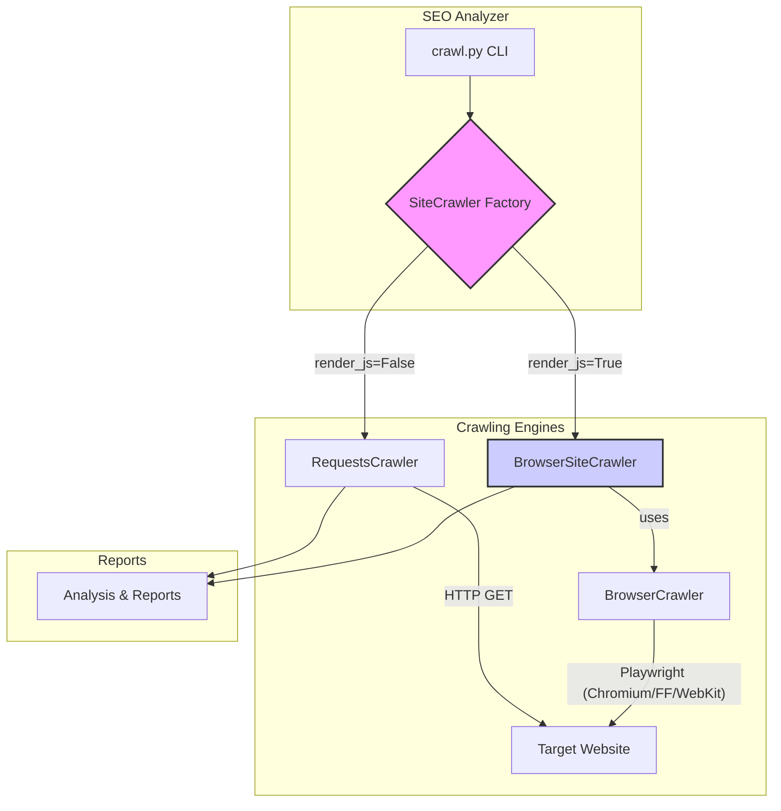

# Executive Summary

The current `requests`-based crawler cannot execute JavaScript, leading to complete analysis failure on Single Page Applications (SPAs) and JavaScript-heavy websites. This proposal outlines the integration of an optional, Playwright-based browser crawler to enable full JS rendering and accurate analysis of modern web applications.

This document provides a comprehensive technical specification for the new `BrowserCrawler`, including its architecture, configuration, and integration into the existing system. Key features include realistic browser emulation, advanced stealth capabilities, performance metric collection, and a robust, asynchronous design optimized for site-wide crawls. The implementation is designed to be optional and configurable, ensuring backward compatibility while providing powerful new capabilities.

---

# System Architecture

The new architecture introduces a parallel crawling path. The `SiteCrawler` will act as a factory, choosing between the existing `RequestsCrawler` and the new `BrowserCrawler` based on user configuration.



---

# Detailed Technical Requirements

## 1. Dependencies and Setup

Playwright and its dependencies will be an **optional dependency group**.

**`pyproject.toml` additions:**
```toml
[tool.poetry.dependencies]
playwright = { version = "^1.40.0", optional = true }
beautifulsoup4 = { version = "^4.12.3", optional = true }


[tool.poetry.extras]
browser = ["playwright", "beautifulsoup4"]

[tool.poetry.scripts]
postinstall = "scripts.py:postinstall"
```

**New `scripts.py` file for post-install hook:**
```python
# scripts.py
import subprocess
import sys

def postinstall():
    """
    Run playwright install.
    """
    try:
        from playwright.sync_api import sync_playwright
    except ImportError:
        print("Playwright is not installed, skipping browser download.")
        return

    print("Running 'playwright install chromium'...")
    try:
        subprocess.run([sys.executable, "-m", "playwright", "install", "chromium"], check=True)
        print("Chromium browser installed successfully.")
    except (subprocess.CalledProcessError, FileNotFoundError) as e:
        print(f"Error installing Chromium browser for Playwright: {e}", file=sys.stderr)
        print("Please run 'playwright install chromium' manually.", file=sys.stderr)

```
This provides a smoother developer setup experience. Users will install with `poetry install -E browser`.

## 2. Configuration Management

Instead of passing dictionaries, we will use `Pydantic` for a validated, type-hinted, and self-documenting configuration object.

**New `src/seo/browser_config.py` module:**
```python
from pydantic import BaseModel, Field
from typing import Optional, List, Literal

class BrowserConfig(BaseModel):
    """Configuration for the Playwright-based BrowserCrawler."""
    headless: bool = True
    stealth_mode: bool = True
    browser_type: Literal["chromium", "firefox", "webkit"] = "chromium"
    timeout: int = Field(default=30000, description="Page load timeout in milliseconds.")
    wait_until: Literal["load", "domcontentloaded", "networkidle", "commit"] = "networkidle"
    mobile: bool = False
    capture_screenshots: bool = False
    capture_network: bool = False
    block_resources: Optional[List[str]] = Field(default_factory=list, description="Resource types to block for faster loading (e.g., 'image', 'font').")

# --- Recommended Defaults ---
FAST_CONFIG = BrowserConfig(
    wait_until="domcontentloaded",
    block_resources=["image", "font", "stylesheet"],
    capture_screenshots=False,
    timeout=15000,
)

FULL_CONFIG = BrowserConfig(
    wait_until="networkidle",
    block_resources=[],
    capture_screenshots=True,
    timeout=30000,
)

STEALTH_CONFIG = BrowserConfig(
    stealth_mode=True,
    wait_until="networkidle",
    timeout=45000,
)
```

## 3. Revised `BrowserCrawler` Architecture

The `BrowserCrawler` will be redesigned to **not** manage the browser lifecycle within the `crawl` method. This is critical for performance, allowing a single browser instance to be reused for an entire site crawl.

**New `src/seo/browser_crawler.py`:**
```python
"""
Browser-based crawler using Playwright for JavaScript-rendered content.
Designed for efficient reuse of a single browser instance.
"""
from playwright.async_api import async_playwright, Browser, Page, BrowserContext
from typing import Optional, Dict, Any, List
from dataclasses import dataclass, field
import time
import random

# Import BrowserConfig from its new module

@dataclass
class BrowserCrawlResult:
    """Result from a single browser-based crawl attempt."""
    url: str
    final_url: Optional[str] = None
    html: Optional[str] = None
    status_code: int = 0
    load_time: float = 0.0
    headers: Dict[str, str] = field(default_factory=dict)
    performance_metrics: Dict[str, float] = field(default_factory=dict)
    console_errors: List[str] = field(default_factory=list)
    network_requests: List[Dict[str, Any]] = field(default_factory=list)
    screenshot: Optional[bytes] = None
    error: Optional[str] = None


class BrowserCrawler:
    """
    Manages a persistent browser instance to perform crawls.
    Use as an async context manager:
    async with BrowserCrawler(config) as crawler:
        result = await crawler.crawl(url)
    """

    def __init__(self, config: BrowserConfig):
        self.config = config
        self._playwright = None
        self._browser: Optional[Browser] = None

    async def __aenter__(self):
        self._playwright = await async_playwright().__aenter__()
        browser_launcher = getattr(self._playwright, self.config.browser_type)
        self._browser = await browser_launcher.launch(headless=self.config.headless)
        return self

    async def __aexit__(self, exc_type, exc_val, exc_tb):
        if self._browser:
            await self._browser.close()
        if self._playwright:
            await self._playwright.__aexit__(exc_type, exc_val, exc_tb)

    async def crawl(self, url: str, context: Optional[BrowserContext] = None) -> BrowserCrawlResult:
        """
        Crawls a single URL using the managed browser instance.
        Optionally accepts an existing BrowserContext for reuse.
        """
        if not self._browser:
            raise BrowserLaunchError("Browser is not running. Use via 'async with'.")

        own_context = context is None
        if own_context:
            context = await self._create_context()
        
        page = await context.new_page()
        
        console_errors: List[str] = []
        page.on("console", lambda msg: (
            console_errors.append(f"{msg.type}: {msg.text}")
            if msg.type == "error" else None
        ))
        
        try:
            # ... (rest of the crawl logic)
            html = await page.content()
            # ... etc.

            return BrowserCrawlResult(...)
        finally:
            await page.close()
            if own_context:
                await context.close()

    async def _create_context(self) -> BrowserContext:
        """Creates a new, isolated browser context."""
        # ... (context creation logic from original document, including stealth)
        # This logic is sound and can be reused here.
        pass

    async def _get_performance_metrics(self, page: Page) -> Dict[str, float]:
        """
        Extract Web Vitals and performance metrics.
        Note: FID (First Input Delay) is deprecated and cannot be measured in a lab environment.
        Its successor, INP (Interaction to Next Paint), is also a field metric and is not
        practical to measure reliably in an automated crawl.
        """
        metrics = await page.evaluate(...) # Original JS for navigation timing
        
        # Updated script for CWV
        try:
            web_vitals = await page.evaluate("""
                () => new Promise((resolve) => {
                    let lcp = 0, cls = 0;
                    new PerformanceObserver((list) => {
                        const entries = list.getEntries();
                        lcp = entries[entries.length - 1].startTime;
                    }).observe({type: 'largest-contentful-paint', buffered: true});
                    new PerformanceObserver((list) => {
                        for (const entry of list.getEntries()) {
                            if (!entry.hadRecentInput) cls += entry.value;
                        }
                    }).observe({type: 'layout-shift', buffered: true});
                    // Give time for metrics to be captured
                    setTimeout(() => resolve({ lcp, cls }), 1000);
                })
            """)
            metrics.update(web_vitals)
        except Exception:
            metrics.update({'lcp': 0, 'cls': 0})
        return metrics

```

## 4. `BrowserSiteCrawler` Implementation

This class orchestrates the site-wide crawl, managing concurrency, rate-limiting, and state.

**`src/seo/browser_site_crawler.py` (New or integrated):**
```python
import asyncio
from typing import Dict, Set, Optional, Callable, List
from urllib.parse import urlparse, urljoin
from bs4 import BeautifulSoup
from .browser_crawler import BrowserCrawler, BrowserCrawlResult, BrowserConfig

class BrowserSiteCrawler:
    """
    Site-wide crawler using a shared Playwright browser instance.
    """
    def __init__(
        self,
        config: BrowserConfig,
        max_pages: int = 50,
        max_concurrent: int = 3,
        rate_limit: float = 1.0, # Seconds between requests
        on_progress: Optional[Callable[[int, int, str], None]] = None
    ):
        self.config = config
        self.max_pages = max_pages
        self.semaphore = asyncio.Semaphore(max_concurrent)
        self.rate_limit = rate_limit
        self.on_progress = on_progress
        self.results: Dict[str, BrowserCrawlResult] = {}
        self.queue: asyncio.Queue[str] = asyncio.Queue()
        self.processed_urls: Set[str] = set()

    async def crawl_site(self, start_url: str) -> Dict[str, BrowserCrawlResult]:
        """Crawl an entire site starting from a given URL."""
        self.base_domain = urlparse(start_url).netloc
        await self.queue.put(start_url)
        self.processed_urls.add(start_url)

        async with BrowserCrawler(self.config) as crawler:
            tasks = set()
            while len(self.results) < self.max_pages:
                if self.queue.empty() and not tasks:
                    break
                
                while not self.queue.empty() and len(tasks) < self.semaphore._value:
                    url = await self.queue.get()
                    task = asyncio.create_task(self._worker(url, crawler))
                    tasks.add(task)

                done, pending = await asyncio.wait(tasks, return_when=asyncio.FIRST_COMPLETED)
                tasks = pending

        return self.results

    async def _worker(self, url: str, crawler: BrowserCrawler):
        """A single crawl worker that acquires a semaphore and respects rate limits."""
        async with self.semaphore:
            await asyncio.sleep(self.rate_limit)
            try:
                result = await crawler.crawl(url)
                self.results[url] = result
                
                if result.html:
                    new_urls = self._find_internal_links(result.html, result.final_url or url)
                    for new_url in new_urls:
                        if new_url not in self.processed_urls and len(self.processed_urls) < self.max_pages:
                            self.processed_urls.add(new_url)
                            await self.queue.put(new_url)

            except Exception as e:
                self.results[url] = BrowserCrawlResult(url=url, error=str(e))
            
            if self.on_progress:
                self.on_progress(len(self.results), self.max_pages, url)

    def _find_internal_links(self, html: str, base_url: str) -> List[str]:
        """Parses HTML to find internal, crawlable links."""
        soup = BeautifulSoup(html, 'html.parser')
        links = []
        for a in soup.find_all('a', href=True):
            href = a['href']
            # Basic filter for non-crawlable links
            if href.startswith(('mailto:', 'tel:', 'javascript:')):
                continue
            
            full_url = urljoin(base_url, href)
            # Clean fragment and ensure it's internal
            parsed_url = urlparse(full_url)
            if parsed_url.netloc == self.base_domain:
                url_without_fragment = parsed_url._replace(fragment='').geturl()
                links.append(url_without_fragment)
        return links

```

## 5. `SiteCrawler` Factory and Integration

The main `SiteCrawler` class will act as a factory, choosing the correct crawling engine and handling the optional nature of the browser dependencies gracefully.

```python
# In src/seo/site_crawler.py

class SiteCrawler:
    def __init__(
        self,
        # ... other params ...
        render_js: bool = False,
        browser_config: Optional[BrowserConfig] = None,
    ):
        self.render_js = render_js
        self.crawler = self._create_crawler(render_js, browser_config)

    def _create_crawler(self, render_js, browser_config):
        if not render_js:
            return RequestsCrawler(...) # Your existing crawler

        try:
            from .browser_site_crawler import BrowserSiteCrawler
            if not browser_config:
                browser_config = BrowserConfig() # Use defaults if none provided
            return BrowserSiteCrawler(config=browser_config)

        except ImportError:
            raise ImportError(
                "Browser rendering requires Playwright and BeautifulSoup4. "
                "Please install with: poetry install -E browser"
            )

    async def crawl(self, start_url: str):
        return await self.crawler.crawl_site(start_url)
```

## 6. Detection Avoidance & Stealth (Enhancements)

The proposed stealth measures are strong. We can enhance them further.

**Refined `_setup_stealth` script:**
```javascript
// In BrowserCrawler._create_context, add_init_script:
await context.add_init_script("""
    // Pass webdriver check
    Object.defineProperty(navigator, 'webdriver', { get: () => undefined });

    // Pass chrome check
    window.chrome = { runtime: {} };

    // Pass permissions check
    const originalQuery = window.navigator.permissions.query;
    window.navigator.permissions.query = (parameters) => (
        parameters.name === 'notifications' ?
            Promise.resolve({ state: Notification.permission }) :
            originalQuery(parameters)
    );

    // Pass plugins check
    Object.defineProperty(navigator, 'plugins', {
        get: () => [
            { name: 'Chrome PDF Plugin', filename: 'internal-pdf-viewer', description: 'Portable Document Format' },
            { name: 'Chrome PDF Viewer', filename: 'internal-pdf-viewer', description: 'Portable Document Format' },
            { name: 'Native Client', filename: 'internal-nacl-plugin', description: '' }
        ]
    });

    // Pass languages check
    Object.defineProperty(navigator, 'languages', { get: () => ['en-US', 'en'] });

    // Pass WebGL vendor check
    try {
        const getParameter = WebGLRenderingContext.prototype.getParameter;
        WebGLRenderingContext.prototype.getParameter = function(parameter) {
            if (parameter === 37445) return 'Intel Open Source Technology Center';
            if (parameter === 37446) return 'Mesa DRI Intel(R) Ivybridge Mobile';
            return getParameter(parameter);
        };
    } catch (e) {}
""");
```

## 7. Testing Strategy (Enhancement)

In addition to testing against live sites, we should create a local test environment for reliability and speed.

-   **`tests/test_browser_crawler.py`**:
    -   Use `pytest-httpserver` to serve local HTML files.
    -   Create a minimal `test.html` with no JS.
    -   Create a `test_spa.html` that uses JavaScript to inject content like `<div id="dynamic">Hello SPA</div>`.
    -   Test that `BrowserCrawler` correctly extracts "Hello SPA" from `test_spa.html`.
    -   Test against a page that simulates bot detection to verify stealth mode works.

This approach makes tests faster, more reliable, and independent of external network conditions or site changes.

## 8. Open Questions (Revised Recommendations)

1.  **Dependency Management**: **Confirmed: Optional.** The `pyproject.toml` `[extras]` approach is correct.
2.  **Screenshot Storage**: **Confirmed.** `crawls/{domain}/{timestamp}/screenshots/` is a sensible structure.
3.  **Default Mode**: **Confirmed: Opt-in.** However, the `should_use_browser` heuristic is valuable. After a `requests`-based crawl returns near-zero content, the tool should **log a warning and recommend re-running with `--render-js`**.
4.  **Resource Limits**: With the new concurrent design, memory can be a concern. The `max_concurrent` setting is the primary lever. We should document that users on memory-constrained systems should reduce this value.
5.  **Lighthouse Integration**: **Confirmed: Yes.** The launched Playwright browser instance should be passed to the `LighthouseRunner` to avoid launching a separate browser, saving significant resources. The runner will need to be adapted to accept an existing browser endpoint.

This revised plan provides a more detailed, robust, and performant blueprint for implementing the browser rendering feature.
